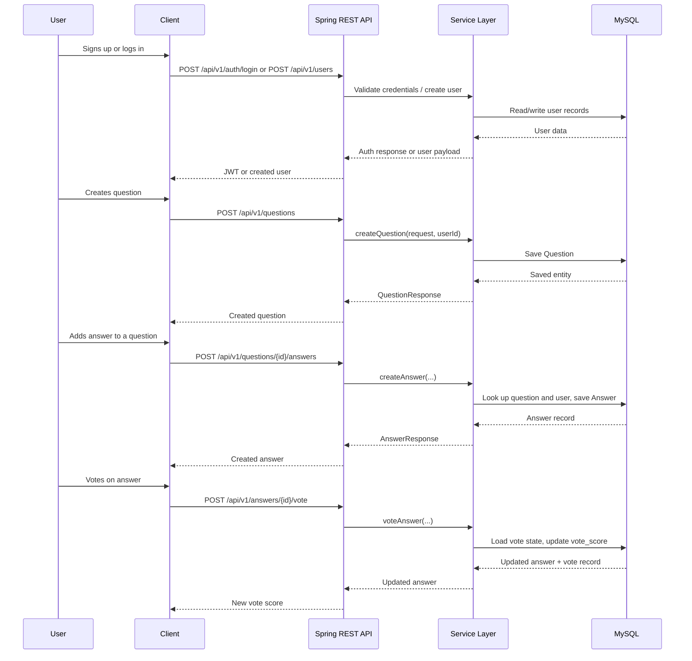
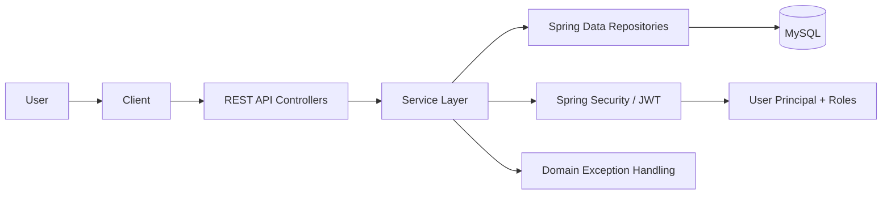

# Project Overview

This repository is a backend-only Q&A application in Java and Spring Boot. It models the core flow of a Stack Overflow-style product: users create questions, answer them, and vote on answers. The project is clearly an MVP or early product backend, not a full production platform, and it is centered on the API layer, persistence, and security rather than a browser frontend.

## 1. Executive Summary

The system solves a familiar problem: people need a place to ask questions, receive answers from others, and evaluate the quality of responses. In the codebase, that is implemented through a Spring Boot REST API with `User`, `Question`, `Answer`, and `Vote` entities, JPA repositories, service-layer business logic, and JWT-based authentication. The main workflow is simple and direct: create a user, authenticate, create a question, answer it, and vote on responses.

The broad architecture is conventional for a Java backend: controllers expose HTTP endpoints, services coordinate business rules, repositories handle database access, and security filters enforce authentication and authorization. The application uses MySQL as the persistence layer, Spring Security for access control, and JWT tokens to authenticate API requests. These choices are appropriate for an early-stage backend and make the project easy to reason about when evaluating the code.

The strongest aspects are the separation of layers, the use of DTOs, explicit validation, and a clear ownership model for questions and answers. The project also demonstrates meaningful business logic in `AnswerServiceImpl`, including vote recalculation and authorization checks. The main limitations are that the repository does not contain a frontend, there is no deployment or CI/CD configuration visible, and some functions are intentionally simple rather than production-hardened. There is no evidence of background jobs, caching, search indexing, auditing, metrics, or health checks.

## 2. Problem Statement

The apparent user problem is the lack of a lightweight, structured question-and-answer system where members can ask for help, provide answers, and surface the highest-quality responses. The repository does not contain market data or product metrics, so this is an inferred problem statement rather than a measured business case.

Without this project, a user would likely rely on ad hoc channels such as chat groups, email threads, or a less structured forum. The project removes friction by creating a clear record for each question and answer and by supporting ownership checks, user validation, and voting. It also reduces noise by providing a way to surface relevant questions through search and a user-based profile model.

The code assumes a modest user base with individual accounts, content ownership, and authenticated access to write operations. It also assumes a classic Q&A model where authorship matters and a user should only update or delete their own content unless they have admin privileges. That is a reasonable MVP assumption, but the repository does not show how moderation, spam prevention, or reputation systems would be handled in a larger system.

## 3. Target Users and Use Cases

### Verified users and use cases

- Registered users create and update their own profiles through `UserController` and `UserServiceImp`.
- Users log in through `AuthController` and receive a JWT from `JwtService`.
- Users create questions through `QuestionController` and `QuestionServiceImp`.
- Users create answers to questions through `AnswerController` and `AnswerServiceImpl`.
- Users vote on answers and the score updates in `voteAnswer`.
- Users can search questions by keyword and retrieve question and answer counts.

### Inferred users and use cases

- Moderators or admins can manage records because `Role.ADMIN` exists and is checked in security expressions.
- The platform is intended for a community of users collaborating on questions and answers, not just a single-user system.
- Users may maintain profiles with `name`, `email`, `username`, and `bio`, suggesting a social/community product.

### Less obvious use cases

- A user may validate whether a username or email is already in use before creating an account.
- A user can fetch all questions and answers associated with a specific user profile.
- A question is searchable by title, which implies a simple content discovery flow.

## 4. Core User Journey

The primary user journey is a registered user creating a question, receiving answers, and participating in ranking via votes.

Important failure points are visible in the code: invalid credentials fail in the authentication flow, missing resources throw domain-specific exceptions, authorization denies modification of records without ownership or admin role, and duplicate usernames or emails are explicitly rejected.

## 5. Feature Breakdown

### Fully implemented features

- User registration and login with password hashing and JWT issuance.
- Question creation, retrieval, updating, deletion, paging, and keyword search.
- Answer creation, retrieval, updating, deletion, and voting.
- Ownership checks for modifying a user, question, or answer.
- Availability checks for usernames and emails.
- Counting user questions and answers.

### Partially implemented features

- Voting is implemented but the repository does not show any reputation system, anti-abuse checks, or vote decay.
- Search is a simple case-insensitive title search rather than a full text-search or vector-search system.
- The app supports admin role checks, but there is no visible admin panel or audit trail for moderation actions.

### Experimental or limited features

- The project has no AI features, no RAG pipeline, and no external API integration in the repository. It is not an AI product.
- The repository shows no background job processing, queueing, or email delivery system.

### Planned or stubbed features

- The code does not clearly include moderator tooling, notification delivery, reputation thresholds, or moderation queues.
- Deployment, observability, and monitoring are absent from the repository evidence.

## 6. Technology Stack

| Layer                | Technology                            | Where It Is Used                                          | Why It Fits                                             | Trade-Offs                                                   |
| -------------------- | ------------------------------------- | --------------------------------------------------------- | ------------------------------------------------------- | ------------------------------------------------------------ |
| Backend              | Java 17 and Spring Boot 4.1.0         | Application bootstrap and REST controllers                | Familiar enterprise backend stack with strong ecosystem | Heavier than a lightweight service but easy to maintain      |
| API                  | Spring MVC / REST controllers         | `controller` package                                      | Clean HTTP layer with validation and DTOs               | Requires additional discipline around contract design        |
| Persistence          | Spring Data JPA + Hibernate           | Repositories and entity models                            | Speeds up CRUD and reduces boilerplate                  | Hidden N+1 and lazy-loading issues can appear                |
| Database             | MySQL                                 | `application.properties` JDBC configuration               | Common relational database with mature tooling          | Requires schema management and operational oversight         |
| Security             | Spring Security + JWT                 | `SecurityConfig`, `JwtAuthenticationFilter`, `JwtService` | Stateless authentication is easy to use in APIs         | Token rotation, logout, and refresh flow are not implemented |
| Authentication model | Username/password + role-based access | `UserPrincipal`, `Role`, `@PreAuthorize`                  | Simple access model for a small app                     | Not sufficient for complex, attribute-based authorization    |
| Validation           | Jakarta Validation                    | DTO classes and controllers                               | Prevents bad input early                                | Validation rules are not broad enough for every edge case    |
| Object mapping       | Lombok + manual mapper classes        | Models and DTO conversions                                | Reduces boilerplate and keeps code readable             | Can hide some complexity if too much is generated            |
| Testing              | Spring Boot test starters + JUnit     | `src/test/java`                                           | Good baseline for integration-style testing             | No evidence of broad end-to-end or mock-heavy suites         |
| Build                | Gradle                                | `build.gradle`                                            | Standard Java build and dependency management           | Project setup is simple but not fully production-optimized   |

## 7. High-Level Architecture

The architecture is a standard layered backend: client requests reach controllers; services apply business logic; repositories interact with the database; and security filters validate the JWT before the request is processed.

The main responsibilities are clear:

- `controller` classes expose the HTTP contract.
- `service` classes implement business rules and validation.
- `repository` interfaces abstract persistence.
- `model` classes represent the domain and database schema.
- `security` classes manage authentication and authorization.
- `exception` and `advice` classes centralize error handling.

This is a sensible design for an API-only service, but it leaves some gaps for a real application: there is no evidence of queue workers, caching layers, or asynchronous processing, and no multi-service decomposition is visible.

## 8. Module and Folder Map

| Path                                             | Responsibility                                         | Important Notes                                                                           |
| ------------------------------------------------ | ------------------------------------------------------ | ----------------------------------------------------------------------------------------- |
| `src/main/java/org/com/quora_backend/controller` | REST endpoints for auth, users, questions, and answers | This is the public API surface                                                            |
| `src/main/java/org/com/quora_backend/service`    | Business logic and validation                          | `UserServiceImp`, `QuestionServiceImp`, `AnswerServiceImpl` are the main execution points |
| `src/main/java/org/com/quora_backend/repository` | JPA repositories                                       | Data access is mostly CRUD plus targeted query methods                                    |
| `src/main/java/org/com/quora_backend/model`      | Entities and enums                                     | `User`, `Question`, `Answer`, `Vote`, `Role`, `VoteType`                                  |
| `src/main/java/org/com/quora_backend/dto`        | Request/response payloads                              | Strong separation between API contracts and persistence objects                           |
| `src/main/java/org/com/quora_backend/security`   | JWT filter, auth entry points, access decisions        | Critical for authn/authz                                                                  |
| `src/main/java/org/com/quora_backend/mapper`     | Entity-to-DTO conversion                               | Keeps controllers and services less coupled to persistence details                        |
| `src/main/java/org/com/quora_backend/exception`  | Business exception types                               | Clear domain errors such as `QuestionNotFoundException`                                   |
| `src/main/java/org/com/quora_backend/advice`     | Global exception handler                               | Centralized error shaping                                                                 |
| `src/main/resources/application.properties`      | Local configuration and datasource setup               | Contains the MySQL URL and JWT properties                                                 |
| `src/test/java`                                  | Project tests                                          | Minimal baseline presence, not a full test suite                                          |

A new engineer should start reading `SecurityConfig`, `AuthController`, `QuestionController`, `AnswerServiceImpl`, and the entity models. Those files explain the core product flow and the most important design decisions.

## 9. Data Model

The central model is relational and straightforward.

- `User` stores identity information, credential hash, and role.
- `Question` belongs to a user and contains a title and description.
- `Answer` belongs to both a question and a user and stores the answer text and vote score.
- `Vote` records a user’s specific vote on a given answer and enforces uniqueness via `(user_id, answer_id)`.
- `BaseModel` provides `id`, `createdAt`, and `updatedAt` for common auditing.

This is a classic relational design well suited to a Q&A site. The `Vote` table is a good sign: it avoids repeated vote calculations and sets the stage for more robust voting logic in the future. However, there is no evidence of a reputation table, comment model, tags, or moderation history. The project currently keeps the domain simple and intentionally compact.

## 10. Security and Authorization

The application uses Spring Security with stateless JWT authentication. `SecurityConfig` permits access to the login endpoint, user creation endpoint, username/email check endpoints, and all GET requests under questions and answers. Everything else requires authentication. This is a reasonable MVP pattern for a backend API.

JWT authentication is handled by `JwtAuthenticationFilter`, which reads the Authorization header and sets the `SecurityContextHolder` when the token is valid. `UserPrincipal` wraps the `User` entity and maps the role to a Spring Security authority, enabling `@PreAuthorize` checks on controllers.

The authorization rules in `QuestionController` and `AnswerController` allow an admin or the content owner to modify a resource. `UserController` does the same for user updates. This is an understandable trade-off for early-stage product logic, but it is limited: there is no refresh-token flow, no token revocation model, no password reset, and no rate-limiting or request throttling evidence.

## 11. Error Handling and Reliability

The repository shows a strong pattern of domain-specific exceptions and centralized error handling. `GlobalExceptionHandler` appears to centralize response mapping, while specific exceptions such as `QuestionNotFoundException`, `UserNotFoundException`, `UnauthorizedAccessException`, and `EmailAlreadyExistsException` represent common application faults.

The app also validates request bodies and checks for duplicate usernames/emails before saving. This reduces broken data and prevents obvious misuse. The competitive strength of the code is that failures are explicit and domain-aware rather than generic, which helps with both debugging and API UX.

The main reliability gaps are that there is no evidence of retry logic, circuit breakers, message queues, or any resilience configuration. There is no health-check endpoint in the repo, and no operational telemetry is defined. A production deployment would need more robust monitoring and failure isolation.

## 12. Testing and Validation

The repository includes a simple Spring Boot test setup in `src/test/java`, and the build configuration includes Spring test dependencies. This indicates the project was intended to have automated validation, but the evidence suggests the test suite is still minimal. There are no obvious tests for the main business flows around question creation, answer voting, or security rules.

For an interview, the honest assessment is: the project demonstrates a testing intention and a valid Spring Boot testing stack, but it does not yet appear to be thoroughly covered. That is a realistic early-stage limitation rather than a design flaw.

## 13. Production-Readiness and Key Limitations

The repository is a solid example of a backend service for a Q&A product, but it is not yet a production-grade platform. The main limitations are:

- No frontend client or end-user experience is present in the codebase.
- No deployment configuration, container setup, CI/CD pipeline, or environment configuration beyond local MySQL settings is visible.
- No observability stack, metrics, or logs beyond Hibernate SQL output is evident.
- There is no pagination strategy beyond basic Spring Data pagination for questions.
- Search is simple rather than indexed or full-text optimized.
- Vote logic exists but has not been extended with reputation, moderation, or abuse detection.
- There are no email notifications, background tasks, or asynchronous workflows.

This is a clear MVP-level architecture: compact, understandable, and feature-complete enough to demonstrate core product logic. The architecture would become a bottleneck only once the project expands to much larger traffic, moderation requirements, or richer community features.

## 14. Interview Angle and Honest Assessment

A strong interview answer is not that this project is “scalable” or “production-ready” in a generic sense. The honest answer is that this is a clean, layered Spring Boot API that enforces core Q&A behaviors with a database model and JWT-based security. It is a good demonstration of service-layer design, repository abstraction, and authorization patterns.

The main engineering decision worth defending is the separation between controller, service, repository, and model layers, plus the explicit ownership model for content. That design makes authorization and business logic easier to test, even though it adds abstraction overhead that might not be necessary at a very small scale.

The most honest limitation to acknowledge is that the project is an API-first MVP rather than a complete social product. The code works as a backend for a Q&A flow, but it needs more operational maturity before it would feel production-ready.

## Assumptions and Confidence

- Verified: The application is a backend REST API for user, question, answer, and vote flows.
- Verified: The project uses Java, Spring Boot, Spring Security, Spring Data JPA, and MySQL.
- Verified: The project uses JWT-based stateless authentication.
- Inferred: The intended audience is a user community asking and answering questions.
- Inferred: The product is in an MVP phase rather than a large-scale deployment.
- Assumed: The application would eventually need moderation, notifications, and observability if it were scaled.

The repository does not contain deployment data, traffic numbers, or a frontend implementation, so any claims about scale, production operations, or end-user product polish should be clearly labelled as assumptions rather than facts.
